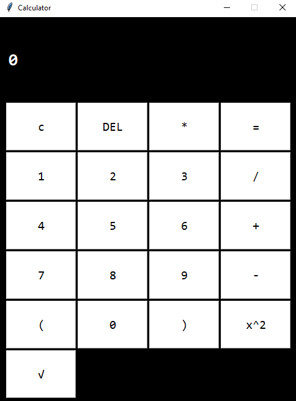

# Calculator
A simple calculator written in Python.

<h1 align="center">Hi, I'm an <a href="https://inginirium.ru/", target="_blank">Inginirium Student</a></h1>

  

<h2 align="center">Computer science student</h2>
